## 들어가며

홍콩을 다녀온 게 2017년. 그 사이 부모님이랑 한 번 더 갔다 왔고, 결혼하고 나서는 시부모님과도 한 번 다녀왔다. 그러다 이번에는 마음먹고 일을 키웠다.

**양가 부모님 다 모시고, 6명이서, 운남성 8일.**

처음 얘기 꺼냈을 때 다들 "그게 되겠어?" 하는 반응이었는데, 결국 갔다. 2026년 4월 26일부터 5월 3일까지. 쿤밍에서 시작해서 다리, 리장, 호도협을 거쳐 다시 쿤밍으로 돌아오는 코스.

쓸 게 너무 많아서 일단 첫 이틀(4/26~27) 먼저 정리한다. 도착하는 날과 다리 입성까지.

> 💸 비용이 궁금하면 [예산 총정리 글]()을 보시는 게 빠르다. 여기는 그냥 일기.

---

## Day 1. 4/26 (일) — 도착, 자정 가까운 쿤밍

출발 전부터 긴장이었다. 6명짜리 여행은 처음이었고, 부모님 두 분씩 두 쌍을 모시고 가는 건 더더욱 처음이었다.

비행기 안에서 기내식이 나왔다. 살짝 호기롭게 하이네켄을 하나 시켰는데, 옆에서 시아버지가 "벌써부터 마시나?" 하시는 눈빛이라 한 캔으로 끝냈다. 음식은 연어 그라탕 비슷한 거랑 또르텔리니 파스타였는데, 기내식치곤 나쁘지 않았다.

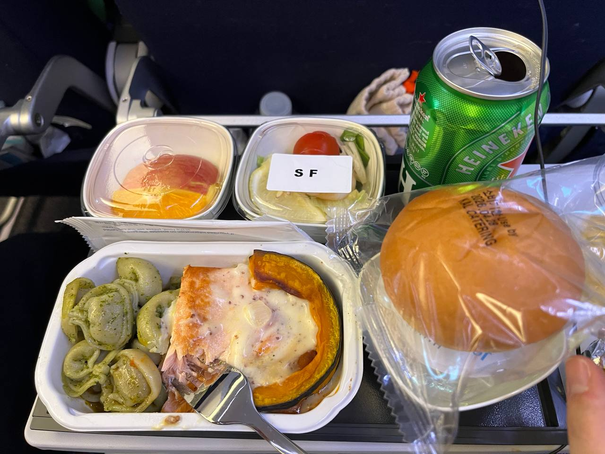

공항 라운지에서는 시간 좀 죽였다. 천장에 매달린 거대한 구리 막대 조명이 인상적이었다. 부모님들은 라운지 음식을 꽤 흡족해하셨다. 처음 라운지 경험이신 분도 계셔서 "이런 게 있구나" 하시면서 신기해하셨다.

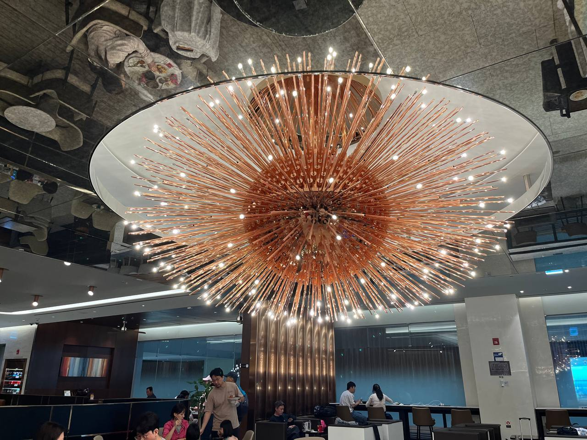

쿤밍 공항 도착이 늦은 밤. 입국 수속, 짐 찾고 나와서 택시 잡으니 자정이 가까웠다. **택시 2대, 공항에서 숙소까지 223위안** (약 4만 8천원). 짐도 많고 어른들 피곤해하셔서 첫날부터 무리하지 않기로 했다.

숙소 들어가서 짐 정리하고 바로 잠. 본 게 거의 없는 하루였지만, 일단 6명이 전부 무사히 도착했다는 것만으로도 다행이다 싶었다.

---

## Day 2. 4/27 (월) — 쿤밍에서 다리까지, 긴 하루의 시작

아침 7시 46분. **운춘소과미선(雲春小鍋米線)**. 쿤밍 사람들이 아침에 먹는다는 미선국 한 그릇으로 본격적인 여행이 시작됐다.

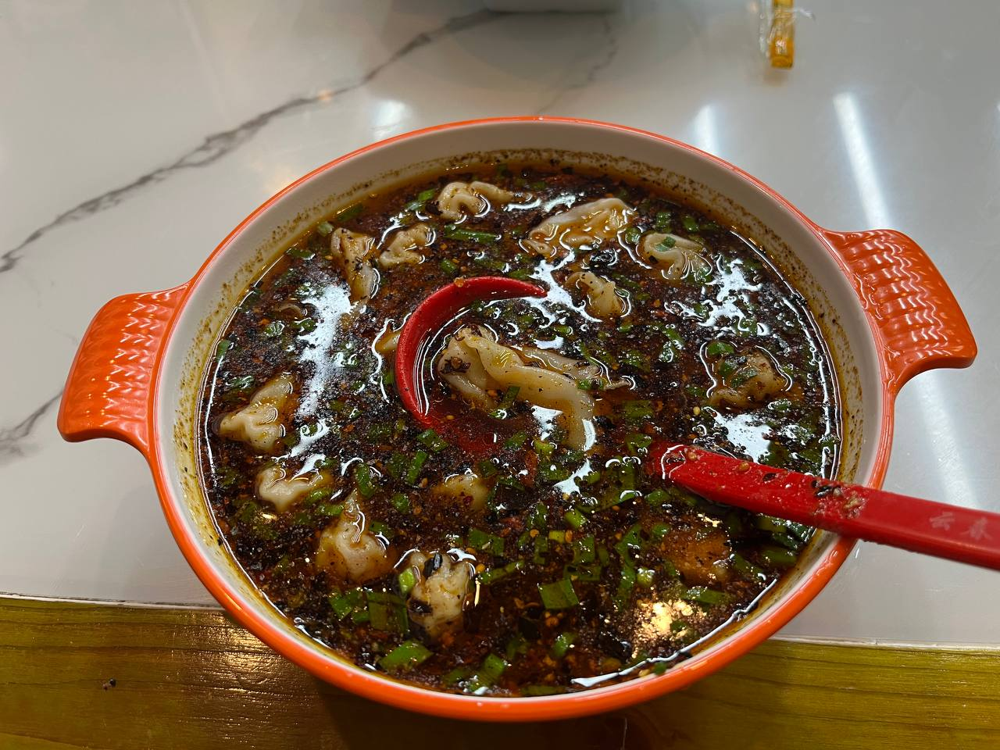

빨간 기름이 떠있는 게 처음엔 무서워 보였는데, 막상 한 입 먹어보니 알싸하지만 부담스럽진 않았다. 시어머니는 "어머, 이거 먹을 만하네?" 하시면서 의외로 잘 드셨다. **6명에 80위안.** 한국 돈으로 1만 7천원 정도. 가격에서 한 번 더 놀랐다.

미선국 먹고 카페에서 잠깐 쉰 다음, 쿤밍 시내를 걷다가 진짜 이 도시가 미친 도시구나 싶었던 순간이 있었다. **자카란다**. 보라색 꽃나무가 거리 양옆으로 끝없이 이어졌다.

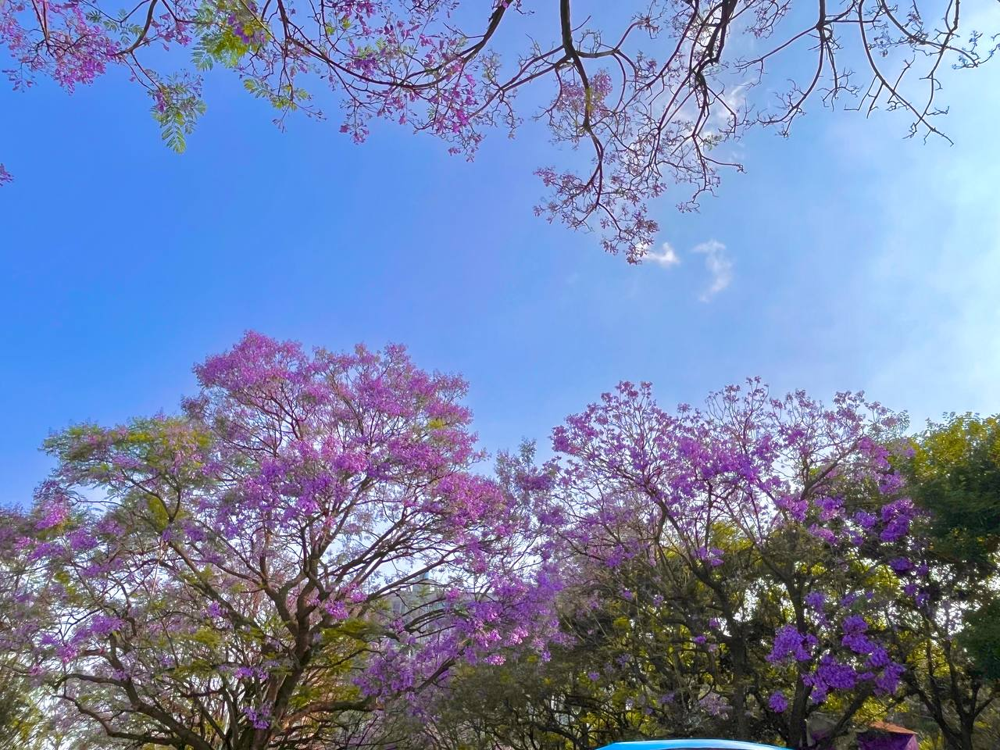

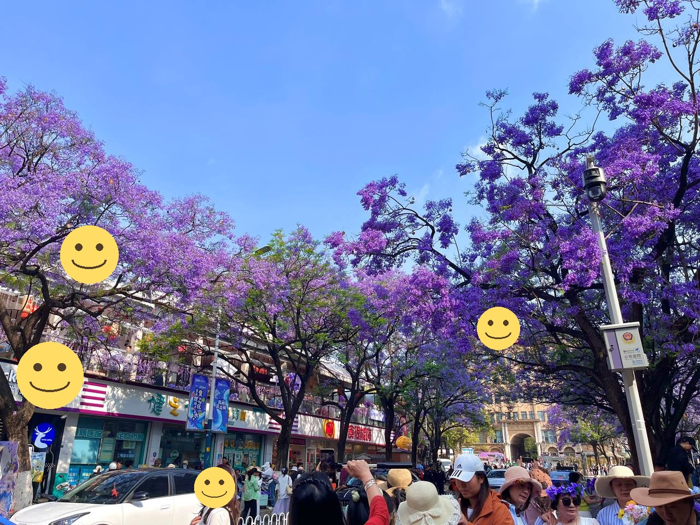

쿤밍이 4월에 자카란다가 만개한다는 건 알고 갔는데, 직접 보니까 사진으로 본 것보다 훨씬 강렬했다. 가지마다 보라색 꽃송이가 뭉텅이로 매달려 있고, 떨어진 꽃이 보도블록을 또 보라색으로 덮어버린다. 어머니들이 한참을 걸음을 멈추셨다.

> 4월 말에 쿤밍 가실 분 있으면 진심으로 추천. 일주일만 빨라도 늦어도 이 풍경은 못 봅니다.

### 쿤밍역에서 다리로

오전 10시 53분, 택시 2대 잡아서 쿤밍역으로 이동. 6인 인솔 첫 미션은 **다리(大理)행 고속철 탑승**이었다.

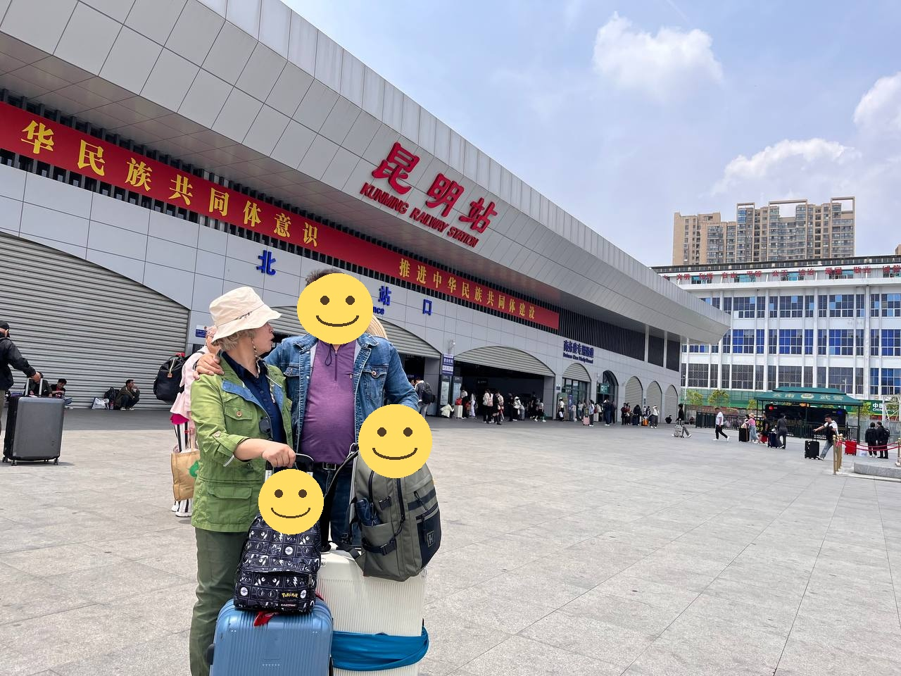

쿤밍역은 생각보다 거대하고 시스템이 깔끔했다. 우리나라 KTX보다 보안이 빡세다. 짐 검사, 신분 확인 두 번. 부모님 네 분 여권 챙기는 게 일이었지만, 다행히 큰 사고 없이 통과.

플랫폼 가는 길에 점심을 챙겼다. **역사 안 푸드코트에서 미선이랑 음료 — 6명 130위안.** 한국 기차역 같으면 한 사람 분 값으로 6명이 먹은 셈이다.

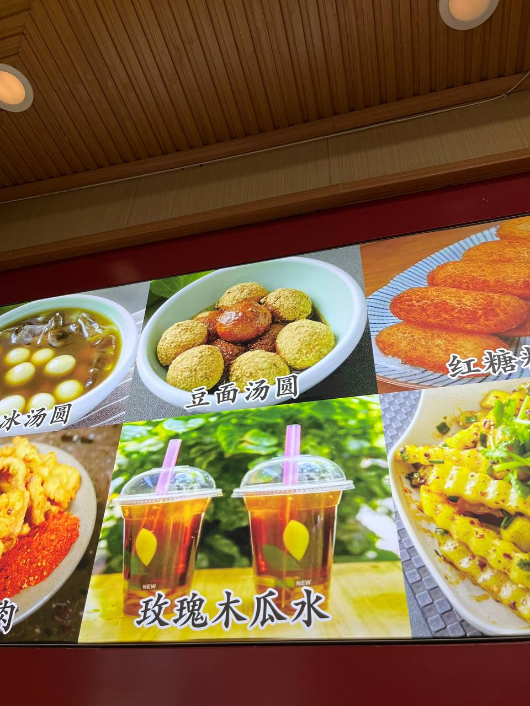

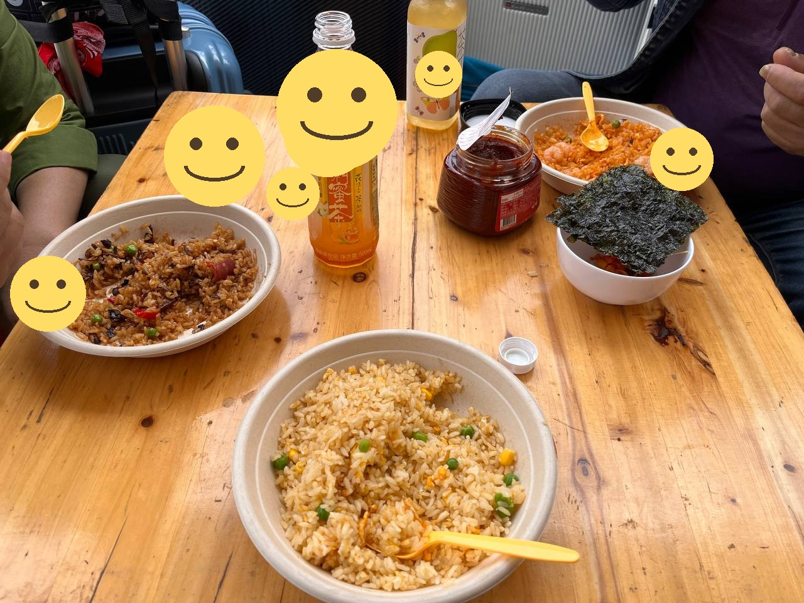

고속철로 다리까지 약 2시간. 창밖으로 운남성의 산세가 펼쳐졌다. 어디 가도 산이 있고, 흙이 붉고, 마을이 작다. 시아버지가 "한국이랑 풍경이 다르네" 하시는데, 그 짧은 한 마디에 만감이 있었다.

### 다리 도착, 그리고 녹차찬청에서의 저녁

다리역 도착이 오후 4시쯤. 짐을 호텔에 던져두고 곧바로 저녁 먹으러 출발했다. 다리고성 안에 있는 **녹차찬청(綠茶餐廳)**. 미리 예약해 둔 곳이었다.

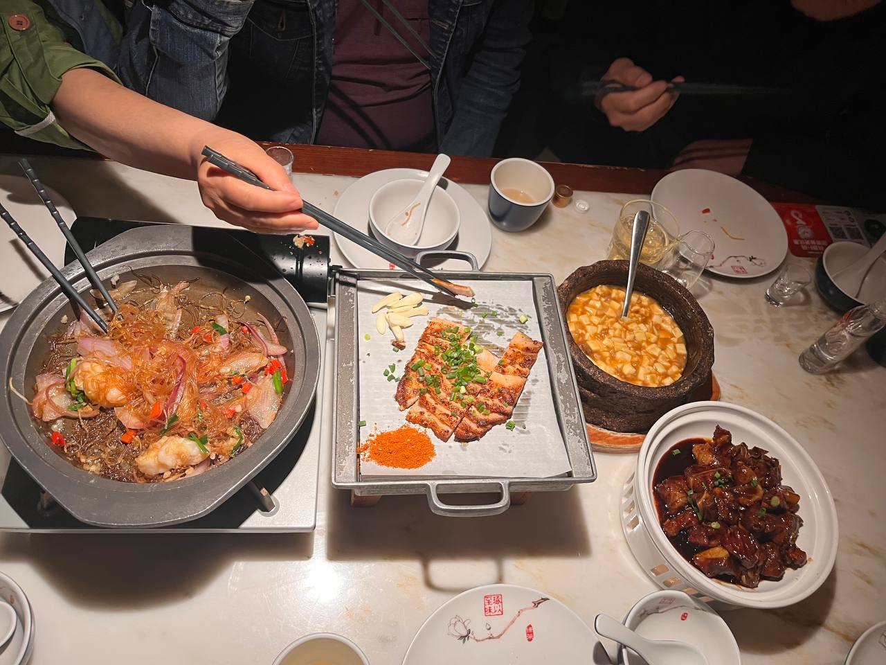

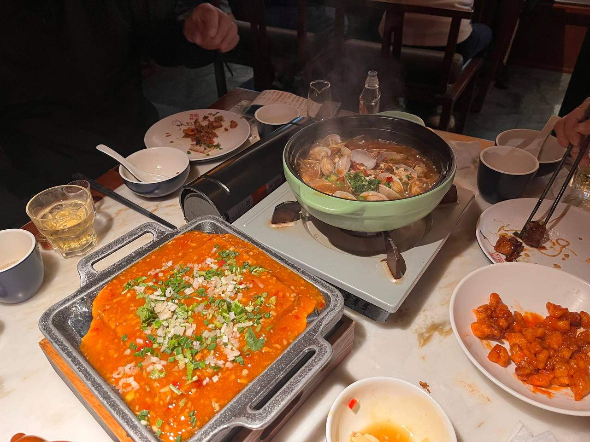

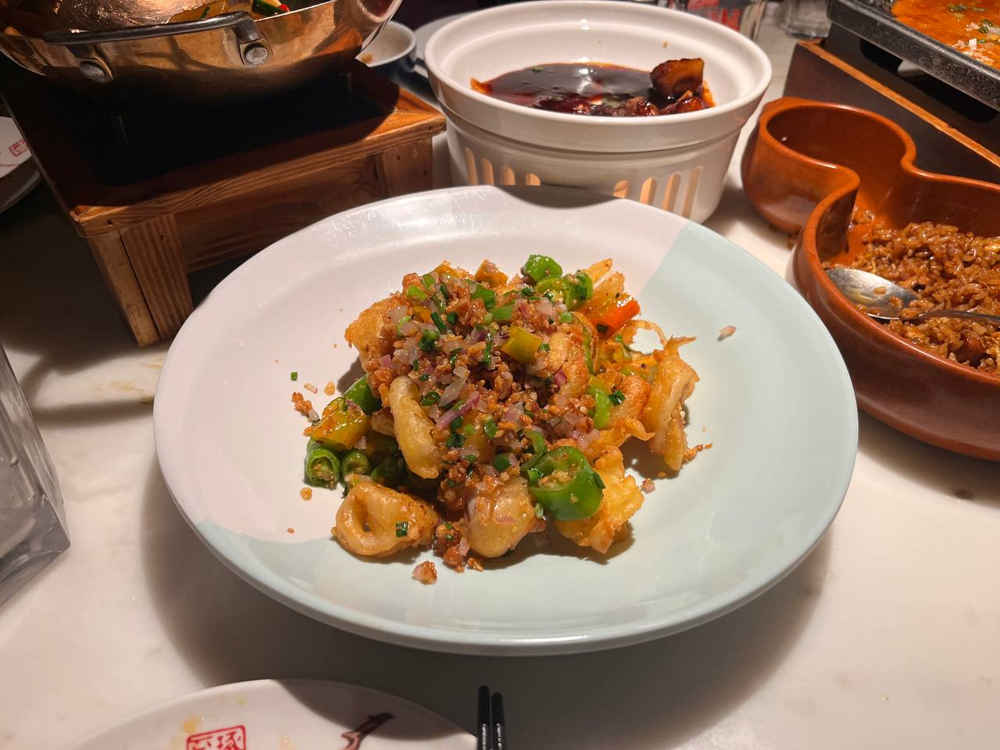

**녹차찬청은 진짜 추천.** 운남식 중식을 깔끔하게 정돈해서 내놓는 체인인데, 음식이 다 정성스럽고 한국인 입맛에도 잘 맞는다. 매운 거 못 드시는 시어머니랑 매콤한 거 좋아하시는 친정아빠가 동시에 만족했다는 게 포인트.

6명 저녁 한 끼에 **94,072원**. 카드로 긁었다. 이거 한국 같으면 한 사람 값이다.

### 다리고성의 밤

저녁 먹고 다리고성 안을 천천히 걸었다. 부모님들이 좀 지쳐 보이셨지만, 다리고성 야경을 안 보고 호텔로 가긴 아쉬웠다. 골목골목 등불이 켜지고 사람들이 가득한데, 묘하게 시끄럽지 않은 분위기.

길 걷다가 어느 가게 앞에서 어머니들이 발걸음을 멈추셨다. 안에 들어가니 천장부터 바닥까지 황금색 재신(財神) 인형이 가득 차 있는 캐리커처/기념품 가게였다. 6인 단체 사진 하나 찍어드렸다.

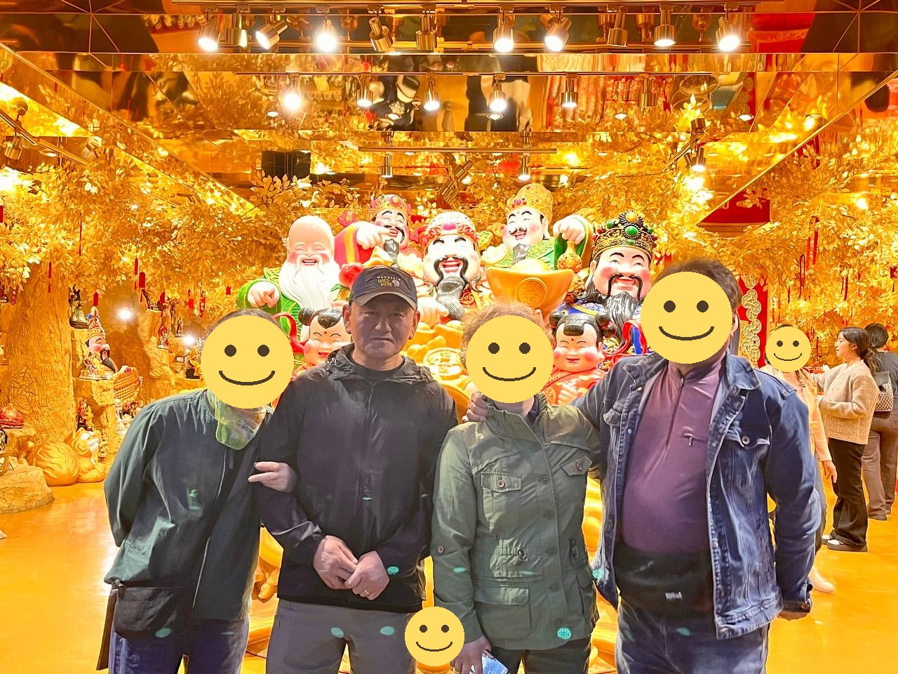

캐리커처 한 장에 **540위안.** 약 11만 7천원. 비싸다 싶었는데, 어머니들이 좋아하시는 게 보여서 그냥 했다. 여행 가서 이런 데서 아끼면 나중에 더 후회한다.

밤 9시 50분쯤 호텔로 복귀. 반산운해에서 기차역 근처 호텔까지 또 택시 2대. 87위안.

### 호텔 방, 그리고 첫날의 마무리

다리 첫 숙소는 거실과 침실이 분리된 아파트형이었다. 6명이 한 공간에 다 있을 수 있는 거실이 있다는 게 의외로 큰 차이를 만들었다. 어른들끼리 거실에서 차 한 잔 마시면서 오늘 얘기 좀 하다가 각자 방으로.

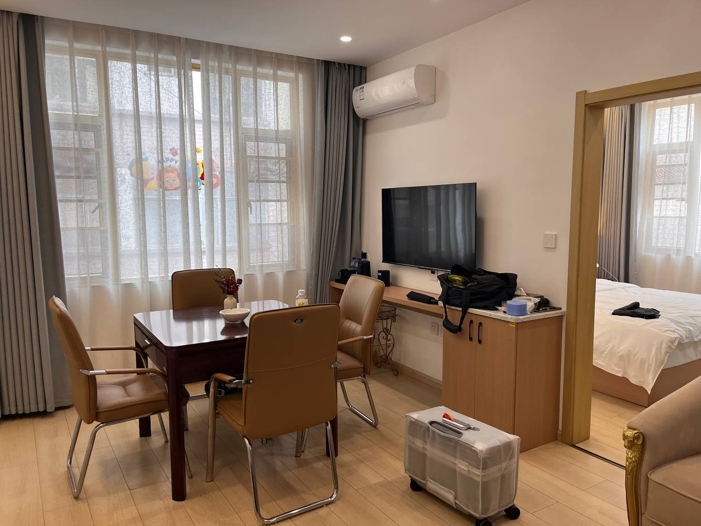

침대에 누우니 하루가 길었다. 자카란다, 미선국, 고속철, 다리고성, 녹차찬청. 첫 이틀치고는 꽤 많이 했다 싶었다.

---

## 4/26~27 비용 요약

| 구분 | 4/26 (일) | 4/27 (월) |
|------|-----------|-----------|
| 식사 (6명) | — | 점심 130위안 + 저녁 94,072원 + 아침 80위안 |
| 교통 | 택시 223위안 | 택시 247.99위안 |
| 관광 | — | 다리고성 캐리커처 540위안 |
| 합계 | **약 4.8만원** | **약 34만원** |

자세한 전체 8일 예산은 [예산 총정리 글]()에.

---

## 첫 이틀의 소감

6명 인솔이 생각보다 안 힘들었다. 그건 부모님들이 다들 적당히 알아서 잘 따라와 주셔서 그랬다. 시키지 않아도 짐 정리 도와주시고, 식당에서도 메뉴 정할 때 "네가 정하는 거 먹을게" 해주시고.

대신 신경 쓸 게 많긴 했다. 약 챙겼는지, 화장실 다녀오셨는지, 환전한 돈은 어디 있는지, 누가 발이 아픈지, 누가 추워하시는지. 그래도 4명이서 갔을 때보다 6명일 때 풍경이 훨씬 풍성했다. 자카란다 거리에서 어머니 두 분이 같이 사진 찍어주시는 모습 같은 거.

다음 글은 다리 둘째 날 + 리장 이동. 옥룡설산도 다음 글에 같이 갈 거 같다.

---

*2026.4.26~27 | 운남성 1~2일차 | 양가 부모님과 6명*
